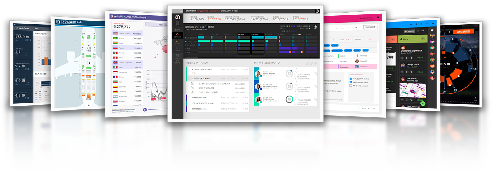
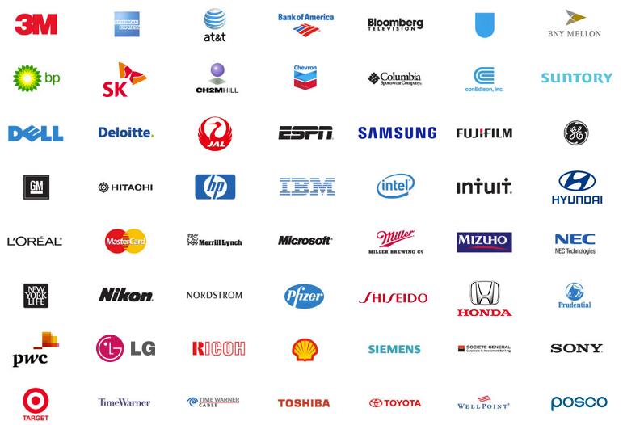
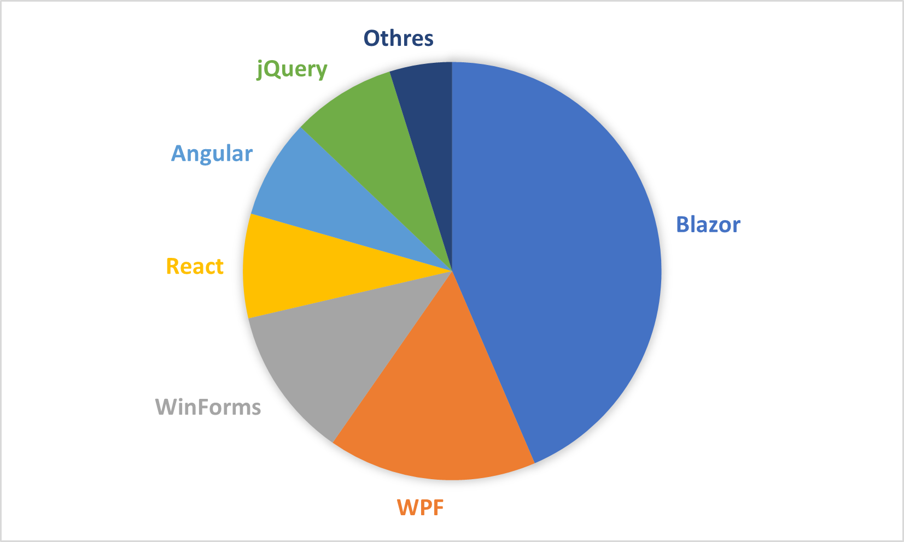
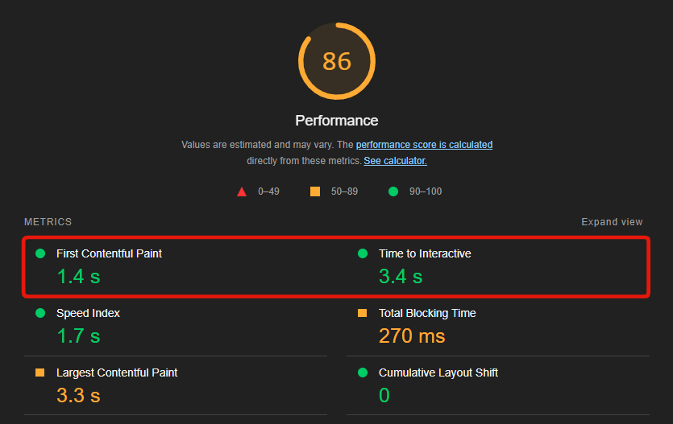
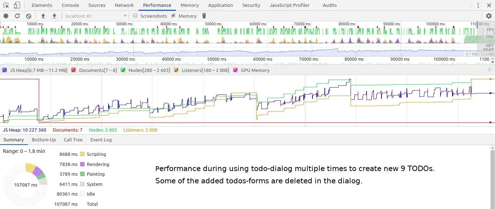
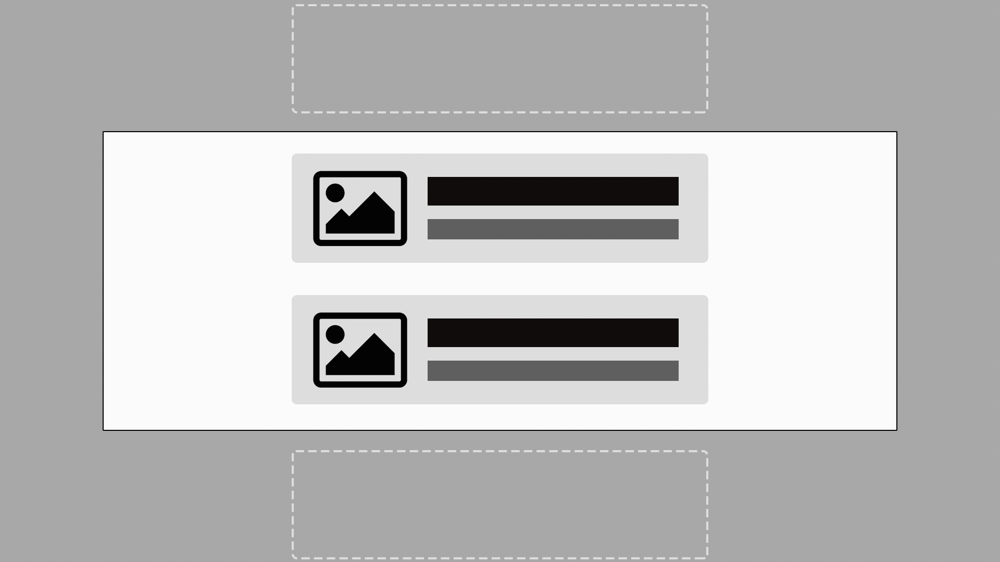
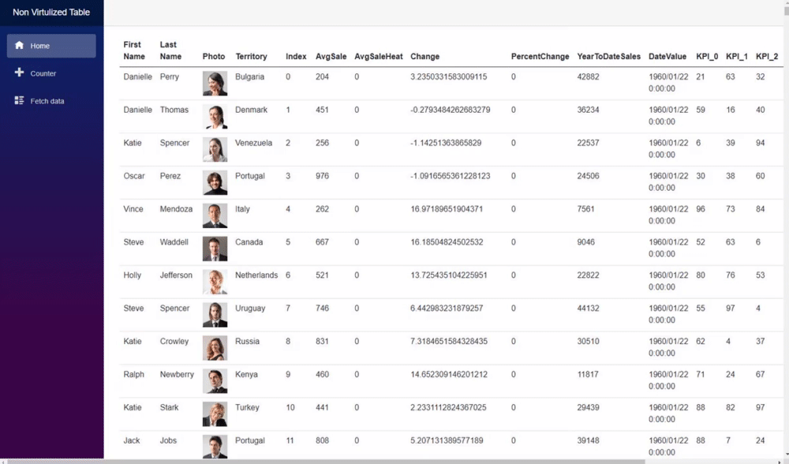
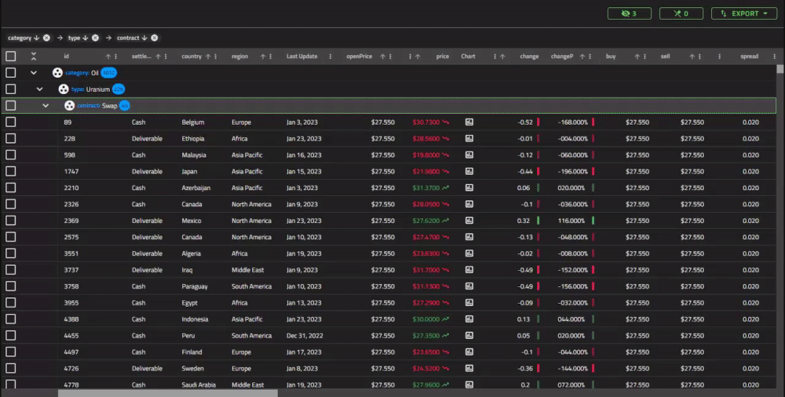

# **.NET Conf 2023 <br>x Seoul**

Let's start developing Blazor applications with "high performance" tuning!

---

# 자기소개

**모토키 나카에**


인프라지스틱스 솔루션 컨설턴트
“고성능" 튜닝으로 Blazor 애플리케이션 개발을 시작해 봅시다!

"강아지 애호가" 입니다.

 <small>MNakae@infragistics.com</small>, <small>ESEA@infragistics.com</small>
 <small>@Kashikoinu</small>

<style scoped>
* {
    vertical-align:middle
}
</style>

---

<div style="text-align:center; margin:0; line-height:1">


</div>

<div style="display:flex; width:102%; justify-content: space-around; text-align:center; margin-top:-50px; margin-left: -2.4%">

<div>

### 켄 아즈마

인프라지스틱스 일본 지사 대표

</div>

<div>

### 조동수

세일즈 매니저, 아시아

</div>

</div>

---

# 인프라지스틱스

<div style="text-align:center">



</div>
저희 인프라지스틱스는 30년동안 개발자를 위해 기능이 뛰어난 UI 컨트롤과 컴포넌트를 제공하고 있습니다.

---



---

# <!-- fit -->246
<style scoped>
* {
    text-align:center
}
</style>

---



---

# 일본의 현 상황

<small>

## 2022년에 Blazor 수요 대폭 증가하였습니다.

</small>

예시 하나를 소개해드리겠습니다.:

- 한 일본 개발자가 공장 내부의 시스템을 위한 데스크톱 애플리케이션을 구현하기 위해 작업하였습니다.
- 하지만 개발자의 관리자를 위해 공장 운영 상태를 볼 수 있는 모니터링 시스템에 대한 새로운 요청을 받았습니다..
- 이 관리자는 작업 중에 많이 이동해야 하므로 어디에서나 액세스할 수 있는 웹 애플리케이션을 원하고 있습니다.
- 하지만 성능도 중요합니다

<style scoped>
li {
    font-size:90%;
}
</style>

---

# 오늘의 주제

- 웹 개발 프레임워크로 Blazor를 추천하는 이유입니다.
- 성능 관점에서 웹 애플리케이션을 관리할 때 주의해야 할 사항들을 알려드리겠습니다.
- “고성능" 튜닝으로 Blazor 애플리케이션 개발을 시작해보겠습니다.
- 더 복잡한 기능적 UI 컴포넌트가 필요한 경우 어떻게 해야할지 알려드리겠습니다.

---

# Blazor를 선택해야 하는 이유

- 당신은 "C# 개발자"입니다.
- Blazor 서버에 익숙합니다.
- 최신 SPA 웹 어플리케이션을 생성할 수 있습니다.
- 문서와 쇼케이스들이 나날이 증가하고 있습니다.
- Microsoft에서 Blazor에 많은 관심을 기울이고 있습니다.
- 저희 인프라지스틱스를 포함하여 많은 라이브러리 공급업체가 Blazor를 채택했습니다.

---

# 이제 Blazor를 시작할 시간입니다!


<style scoped>
h1 {
    text-align:center;
    padding-top:3.95em;
}
</style>

---

# <!-- fit -->웹 어플리케이션 성능
<style scoped>
* {
    text-align:center;
    padding-top:3.75em;
}
</style>

---

# <!-- fit -->웹 앱 성능의 세 가지 포인트

<small>

## 1. 로드 시간 성능

</small>

- 웹 애플리케이션이 로드되는 속도입니다.
- 데스크톱 앱의 경우 애플리케이션을 실행하고 사용자와 상호작용을 시작할 수 있는 시간입니다.
- 이 성능을 측정하려면 Lighthouse를 사용하는 것이 좋습니다.
- 먼저 "First Contentful Paint" 지표를 확인해야 합니다.

---


<style scoped>
* {
    text-align:center;
    vertical-align:center;
    padding-top:14px;
}
</style>
---

# 로드 시간을 줄이려면

<table>
    <thead>
        <tr>
            <th></th>
            <th>Tips</th>
            <th>Sample Result</th>
        </tr>
    </thead>
    <tbody>
        <tr>
            <th>Blazor Server</th>
            <td>Basically, you don't have to care.</td>
            <td>-</td>
        </tr>
        <tr>
            <th rowspan="4">Blazor WebAssembly</th>
            <td>Brotli를 사용하여 파일을 압축합니다.(<a href="https://learn.microsoft.com/en-us/aspnet/core/blazor/host-and-deploy/webassembly?view=aspnetcore-7.0#customize-how-boot-resources-are-loaded">document</a>)</td>
            <td>80%</td>
        </tr>
        <tr>
            <td>게시된 출력 크기를 줄이기 위해 IL 트리밍을 켭니다.(<a href="https://learn.microsoft.com/en-us/aspnet/core/blazor/host-and-deploy/configure-trimmer?view=aspnetcore-7.0">document</a>)</td>
            <td>44%</td>
        </tr>
        <tr>
            <td>wasm-tools 설치합니다.(<a href="https://devblogs.microsoft.com/dotnet/asp-net-core-updates-in-net-6-rc-2/#native-dependencies-support-for-blazor-webassembly-apps">document</a>)</td>
            <td>7%</td>
        </tr>
        <tr>
            <td>가능하면 세계화 및 타임존 기능을 사용하시지 마세요(document <a href="https://learn.microsoft.com/en-us/aspnet/core/blazor/performance?view=aspnetcore-7.0#minimize-app-download-size">1</a> / <a href="https://learn.microsoft.com/en-us/dotnet/core/runtime-config/globalization">2</a>)</td>
            <td>37%</td>
        </tr>
    </tbody>
</table>

<style scoped>
table {
    font-size:30px;
}
</style>

---

# <!-- fit -->웹 앱 성능의 세 가지 포인트

<small>

## 2. 런타임 성능

</small>

- 웹 앱이 사용자 상호 작용에 얼마나 반응하는지 봐야합니다.
- Chrome 개발자 도구는 성능 병목 현상을 식별하는 데 유용합니다.
- 런타임 성능을 개선하기 위한 몇 가지 가이드들이 있습니다:

    - 총 노드 수는 1500개 미만이어야합니다.  최대 깊이는 32노드이어야합니다.  상위 노드에는 60개 이상의 하위 노드가 없어야합니다
    - 이미지 크기를 적절하게 조정하거나 lazy 로드 이미지여야 합니다

---

# 크롬 개발자 툴

<div style="text-align:center">



</div>

<style scoped>
div {
    text-align:center;
}
</style>

---

# <!-- fit -->웹 앱 성능의 세 가지 포인트

<small>

## 2. 런타임 성능

</small>

- 웹 앱이 사용자 상호 작용에 얼마나 반응하는지 봐야합니다.
- Chrome 개발자 도구는 성능 병목 현상을 식별하는 데 유용합니다.
- 런타임 성능을 개선하기 위한 몇 가지 가이드들이 있습니다.:

    - 총 노드 수는 1500개 미만이어야합니다.  최대 깊이는 32노드이어야합니다.  상위 노드에는 60개 이상의 하위 노드가 없어야합니다
    - 이미지 크기를 적절하게 조정하거나 lazy 로드 이미지여야 합니다

---

# <!-- fit -->웹 앱 성능의 세 가지 포인트

<small>

## 3. 부드러운 성능

</small>

이 특징은 말하기 쉽지 않고 측정하기도 어렵습니다. 
예를 들어 사용자 경험과 관련이 있습니다:

사용자가 사용하려는 기능을 쉽게 찾고 탐색할 수 있어야합니다.
애플리케이션의 모양과 느낌이 얼마나 매력적인지 알아야합니다.
엔드유저가 무엇을 잘못했는지 이해하기 위해 소프트웨어가 생성하는 오류 메시지가 얼마나 좋은지알아야합니다.

---

# <!-- fit -->웹 애플리케이션 성능 팁
<style scoped>
* {
    text-align:center;
    padding-top:3.75em;
}
</style>

---

# 컴포넌트 가상화

가상화란 UI 렌더링을 현재 보이는 부분으로만 제한하는 기술입니다.

- 목록, 카드, 테이블과 같은 방대한 양의 반복 콘텐츠에 이 기술을 사용할 수 있습니다.
- 스크롤 위치를 계산하여 가시 영역 내에 필요한 DOM을 렌더링하기만 하면 됩니다.
- 렌더링된 DOM은 가시 영역 밖으로 나가면 파괴됩니다.
- 이것이 Blazor의 기본 기능입니다.


---



---

# <!-- fit -->10k 아이템으로 가상화 테이블을 만들어 봅시다

```html
<table>
    ...
        @foreach (var item in Items)
            <tr>
                <td>@item.FirstName</td>
                <td>@item.LastName</td>
                ...
        }
```

```html
...
        <Virtualize Items="@Items" Context="item">
            <tr>
                <td>@item.FirstName</td>
                <td>@item.LastName</td>
                ...
        </Virtualize>
```

<style scoped>
code {
    font-size: 60%;
}
</style>

---

# 가상화를 하지 않으면 어떻게 됩니까?

<small>

## 10,000 아이템

</small>

<div>


</div>

<style scoped>
div {
    text-align:center;
}
</style>

---

<small>

## 2,500 아이템

</small>



<style scoped>
h2 {
    color:#fff;
    background: rgba(0,0,0,.5);
    display: inline-block;
    padding: .3em
}
</style>

---

# 가상화의 결과를 봅시다
<style scoped>
* {
    text-align:center;
    padding-top:3.75em;
}
</style>

---


---


---

# <!-- fit -->더 복잡한 기능 UI가 필요하십니까?
<style scoped>
* {
    text-align:center;
    padding-top:3.75em;
}
</style>

---

# 기능과 성능을 모두 유지하는 것은 매우 어렵습니다.

- 가능에 대한 요청은 끝나지가 않습니다.

    - 정렬, 필터링, 바로 가기 등록 등등이 있죠..

- 기능적 UI 컨트롤에 대한 성능 조정의 어려움이 증가합니다.
- 엔드유저가 각 기능을 탐색하기가 너무 어렵고 좋지 않은 사용자 경험을 만듭니다.


---



<!--
_backgroundColor: #202020
-->

---

# 일본에서 저희가 고객을 위해 한일

- Blazor를 새로운 프레임워크로 채택하도록 지원했습니다.
- 초보 개발자를 위해 Blazor를 배우기 위한 교육 비디오를 제공했습니다.
- 컨트롤을 통해 UI 요구 사항을 해결했습니다.
- 컨설팅 서비스를 제공합니다.


---

# 마지막으로

<style scoped>
div {
    font-size: 120%;
    line-height:1.6
}
li {
    margin-bottom:1em
}
</style>

<div>

- 망설일 필요 없이 지금 Blazor로 시작해보세요!
- 성능을 위해 세 종류의 문제를 처리하십시오!
- 복잡한 UI가 필요한 경우 저희 인프라직스틱스와 같은 전문가에게 의존하십시오!

</div>
